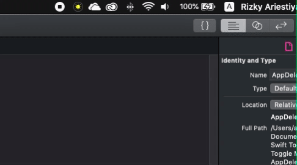

# Swift Toggle Mode

Easily switch dark mode in macOS mojave.

## Preview




## How To

Required: 
- Xcode Version 10.2
- Swift 4 or 5

Clone this repository

```
$ git clone git@github.com:ariestiyansyah/swift-toggle-mode.git
```

Open `Swift Toggle Mode.xcodeproj` file using Xcode, Build and Run

